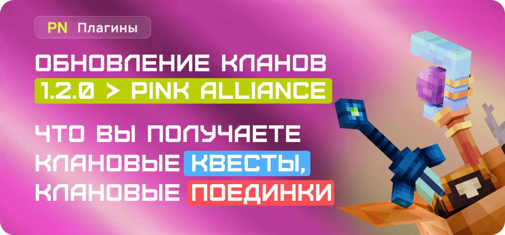
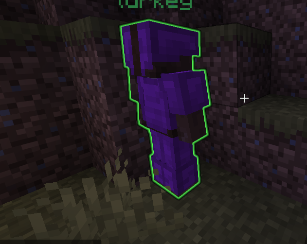
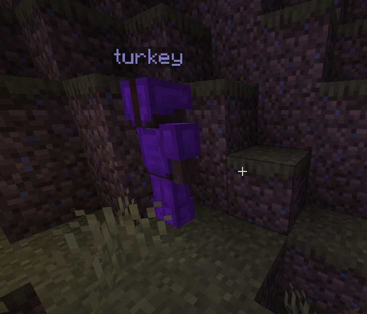
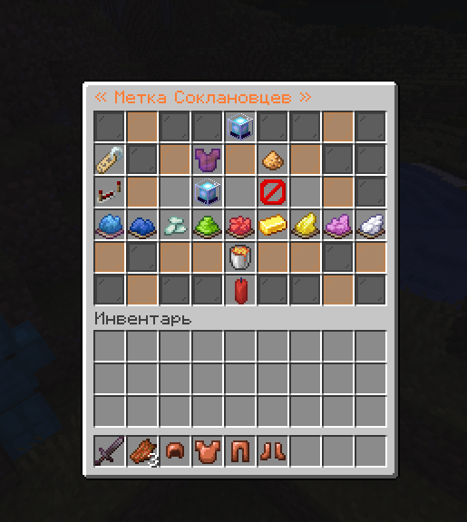
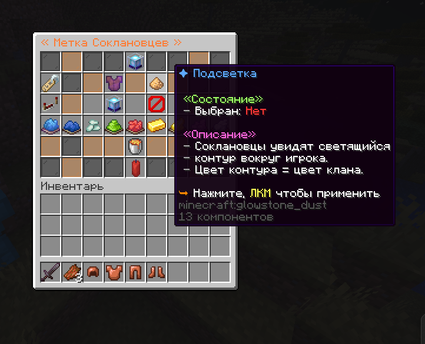
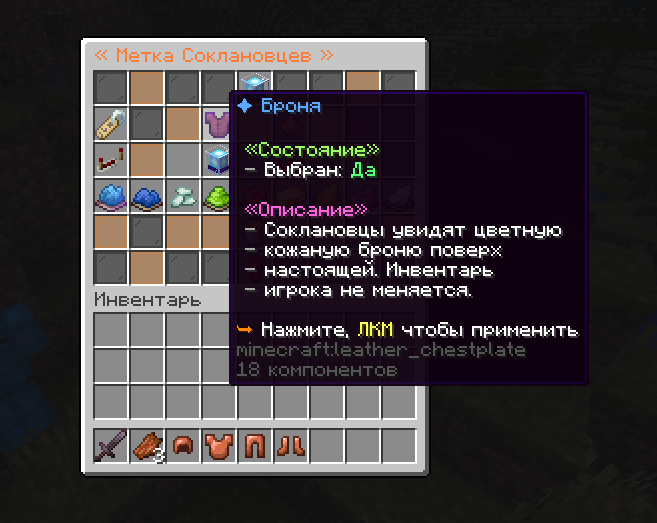

<div align="center">

# pnClans

### Клановая система для Paper, в которой всё важное находится в одном меню

[](https://github.com/pnFolder/pnClans/releases)
[](https://papermc.io/)
[](https://adoptium.net/)
[](https://github.com/pnFolder/pnClans/tree/dev)



<a href=".github/assets/v1.0.5/media_1786052370284.png">
  
</a>

<sub>Нажмите на изображение, чтобы открыть его в полном размере.</sub>

</div>

> **pnClans** объединяет клановое управление, роли, казну, дома, склад, прокачку, PvP и клановый чат в понятный GUI. Плагин рассчитан на серверы Paper и поддерживает расширение через API и аддоны.

<div align="center">

[Установка](#установка) | [Команды](#команды) | [Возможности](#возможности) | [Галерея](#галерея) | [Настройка](#настройка) | [PlaceholderAPI](#placeholderapi) | [API](#api-и-аддоны)

</div>

## Возможности

| Для игроков | Для лидера клана | Для сервера |
| --- | --- | --- |
| Удобное главное меню `/clan` | Роли и права участников | SQLite или JSON-хранилище |
| Клановые дома и телепортация | Казна и история операций | Vault и PlaceholderAPI |
| Общий виртуальный склад | Настройки PvP, чата и уведомлений | Настраиваемые GUI и сообщения |
| Топ кланов и статистика | Прокачка и уровни клана | API, аддоны и внешние подкоманды |
| Подсветка соклановцев | Цвет и режим отображения подсветки | Проверка обновлений |

### Подсветка соклановцев

Новая система меток делает командную игру удобнее: игроки одного клана могут видеть друг друга через контур или цветную виртуальную броню. Цвет, режим и условие показа выбираются в меню настроек клана.

<p align="center">
  <a href=".github/assets/v1.0.5/media_1786052370284.png"></a>
  <a href=".github/assets/v1.0.5/media_1786052354572.png"></a>
</p>

## Галерея

Все изображения кликабельны и открываются в исходном размере.

<p align="center">
  <a href=".github/assets/v1.0.5/media_1786052327760.png"></a>
  <a href=".github/assets/v1.0.5/media_1786052339763.png"></a>
</p>
<p align="center">
  <a href=".github/assets/v1.0.5/media_1786052334695.png"></a>
  <a href=".github/assets/v1.0.5/media_1786052370284.png"></a>
</p>

## Установка

1. Скачайте подходящий JAR со страницы [Releases](https://github.com/pnFolder/pnClans/releases): `pnClans-<version>-java21-all.jar` для Java 21 или `pnClans-<version>-java25-all.jar` для Java 25. Для сборки используйте `./gradlew.bat build -PjavaTarget=21` или `./gradlew.bat build -PjavaTarget=25`.
2. Поместите JAR в папку `plugins/` вашего Paper-сервера.
3. Для экономики установите Vault и совместимый экономический плагин.
4. Перезапустите сервер. Плагин создаст `config.yml`, `menus.yml`, `messages.yml`, `quests.yml` и `battles.yml` в папке `plugins/pnClans`.

<details>
<summary><b>Требования и зависимости</b></summary>

| Компонент | Назначение | Обязателен |
| --- | --- | --- |
| Paper `1.21.11` | Целевое ядро сборки и проверки релиза | Да |
| Java `21` или `25` | Среда запуска и версия байткода выбранного JAR | Да |
| Vault + экономика | Стоимость создания клана и казна | Для экономики |
| PlaceholderAPI | Плейсхолдеры для TAB, чатов и скорбордов | Нет |
| PlayerPoints | Альтернативная валюта кланового магазина | Нет |

</details>

### Поддержка версий Minecraft

- Минимальная заявленная версия: Paper `1.16.5`.
- Релиз компилируется против Paper API `1.21.11` и проверяется на Paper `1.21.11` с Java `21` и `25`.
- Код не использует API ниже Paper `1.18` без необходимости, поэтому Paper `1.18` и новее остаётся поддерживаемым диапазоном при запуске на соответствующей Java.
- Paper `1.16.5`–`1.17.1` работает в режиме best effort; корректная работа всех функций на этих версиях не гарантируется.
- Если возникнет проблема совместимости, приложите лог запуска и версию Paper в теме форума нашего [Discord-сервера](https://discord.gg/TFdnyvMft).

## Команды

Главная команда: `/clan`. Алиасы: `/c`, `/clans`.

| Команда | Что делает |
| --- | --- |
| `/clan` или `/clan menu` | Открывает главное меню клана. |
| `/clan create <название>` | Создаёт клан. Если не указать название, откроется меню. |
| `/clan accept <клан>` | Принимает приглашение в клан. |
| `/clan deny <клан>` | Отклоняет приглашение. |
| `/clan top` | Открывает топ кланов. |
| `/clan stats [игрок] [day\|week\|month\|all]` | Показывает убийства, смерти и K/D участника в текущем клане за UTC-период. |
| `/clan battle` | Открывает поле клановых битв. |
| `/clan battle <клан>` | Отправляет выбранному клану боевой вызов. |
| `/clan battle accept <challenge-id>` | Принимает входящий боевой вызов. |
| `/clan battle decline <challenge-id>` | Отклоняет входящий боевой вызов. |
| `/clan home [ключ]` | Телепортирует к клановому дому. |
| `/clan sethome [ключ]` | Устанавливает клановый дом. |
| `/clan delhome [ключ]` | Удаляет клановый дом. |
| `/clan deposit` или `/clan withdraw` | Открывает казну. |
| `/clan chest` | Открывает общий склад клана. |
| `/clan reload` | Перезагружает конфигурации и открытые GUI. Требует `pnclans.admin`. |
| `/clan admin help` | Показывает полный набор административных операций. |

<details>
<summary><b>Права Bukkit</b></summary>

| Право | По умолчанию | Назначение |
| --- | --- | --- |
| `pnclans.use` | Все игроки | Базовый доступ к pnClans. |
| `pnclans.admin` | OP | Доступ к проверке кланов, MMR, казне, очкам, уровням, участникам, квестам, битвам, сохранению и reload. |

Права на действия внутри клана выдаются лидером через роли в GUI. Это доступ к казне, приглашениям, домам, складу, улучшениям, PvP, чату, подсветке и организации клановых битв. Отправка, принятие и отклонение боевого вызова требуют права `START_BATTLE`.

</details>

## Настройка

| Файл | Что настраивается |
| --- | --- |
| `config.yml` | Модули, хранилище, экономика, роли, клановый чат и подсветка. |
| `menus.yml` | Внешний вид GUI, слоты, предметы и список клановых домов. |
| `messages.yml` | Сообщения, звуки, title, action bar и частицы для игровых событий. |
| `shop.yml` | Категории, редкости, товары, валюты, способы оплаты, награды и внешний вид кланового магазина. |
| `quests.yml` | Каталог клановых квестов и требования магазина. |
| `battles.yml` | Арены, правила, лимиты, награды и внешний вид поля клановых битв. |

В `config.yml` можно отключить отдельные модули: `homes`, `treasury`, `chest`, `upgrades` и `pvp`. Для кланового чата доступны два режима: префикс сообщения, например `!Привет`, или отдельная команда, например `/cc Привет`.

### Награды магазина

Каждый товар в `shop.yml` может комбинировать несколько действий из `rewards`. Стандартные примеры включают команду консоли и зачарованный предмет.

```yaml
rewards:
  - !console_command
    command: "minecraft:give {player} golden_apple {quantity}"
  - !item_reward
    item: DIAMOND_SWORD
    amount: 1
    name: "&#5EA9FDКлинок клана"
    lore:
      - "&7Выдан игроку &f{player}"
    enchantments:
      SHARPNESS: 5
      UNBREAKING: 3
    unbreakable: true
```

В наградах доступны `{player}`, `{player_name}`, `{product}`, `{quantity}` и `{clan}`. Предметы с количеством выше размера стака выдаются несколькими стаками; остаток падает рядом с покупателем.

### Клановые квесты и битвы

Квесты имеют общий прогресс клана и получают прогресс из реальных действий: убийств игроков и мобов, активности, вступления участников, домов, казны, магазина и организованных битв. Квесты могут иметь prerequisites, повторяться ежедневно или еженедельно и выдавать клановые очки и настроенные `Action`-награды.

Клановая битва проходит на арене из `battles.yml`: один клан отправляет вызов, второй подтверждает его, после чего участники телепортируются на две точки. Бой заканчивается достижением лимита убийств, таймером или forfeit. Победитель получает MMR и очки, а убийства, урон, участие и победы двигают боевые квесты. Управление доступно в `/clan` → `Клановые битвы` или через `/clan battle accept <challenge-id>` и `/clan battle decline <challenge-id>`.

Модуль битв по умолчанию выключен. Перед установкой `enabled: true` укажите для каждой арены точный загруженный мир, две безопасные точки появления и `radius`. Арена резервируется за одним матчем, а участники не могут покинуть настроенный радиус до завершения боя.

Активный бой защищён от разрушения состояния: обычный reload блокируется до завершения матча, удаление клана требует явного подтверждения и завершает бой техническим поражением, а выход последнего бойца означает forfeit. Активные матчи и ожидающие вызовы не сохраняются между перезапусками сервера.

### Администрирование

`/clan admin` работает и от игрока, и из консоли. Изменения журналируются в серверном логе.

- `/clan admin info <clan>` — сводка клана.
- `/clan admin stats <player> [day|week|month|all]` — статистика любого текущего участника.
- `/clan admin mmr <add|remove|set> <clan> <amount>` — изменение MMR.
- `/clan admin bank <add|remove|set> <clan> <amount>` — изменение казны с записью в журнал операций.
- `/clan admin points <add|remove|set> <clan> <amount>` — изменение клановых очков через событийный сервис.
- `/clan admin level set <clan> <1..5>` — установка уровня.
- `/clan admin member remove <player>` — исключение участника; лидер защищён от случайного удаления.
- `/clan admin quest reset <clan> <quest-id>` — полный сброс одного квеста.
- `/clan admin battle stop <clan> [winner-clan]` — контролируемое завершение матча.
- `/clan admin save` и `/clan admin reload` — сохранение и перезагрузка конфигураций и данных.

## PlaceholderAPI

Расширение `pnclans` подключается автоматически, если PlaceholderAPI установлен. Используйте плейсхолдеры в скорбордах, TAB, чатах и других совместимых плагинах.

| Плейсхолдер | Значение | Без клана |
| --- | --- | --- |
| `%pnclans_clan%` или `%pnclans_name%` | Название клана игрока | `Нет` |
| `%pnclans_tag%` | Цветной тег `[Название]` | Пустая строка |
| `%pnclans_role%` | Роль игрока | `Нет` |
| `%pnclans_level%` | Уровень клана | `0` |
| `%pnclans_balance%` или `%pnclans_bank%` | Баланс казны | `0` |
| `%pnclans_mmr%` | Рейтинг клана | `0` |
| `%pnclans_kills%` | Убийства клана | `0` |
| `%pnclans_deaths%` | Смерти клана | `0` |
| `%pnclans_battle_wins%` | Победы в организованных битвах | `0` |
| `%pnclans_battle_losses%` | Поражения в организованных битвах | `0` |
| `%pnclans_wins%` или `%pnclans_losses%` | Короткие алиасы побед и поражений | `0` |
| `%pnclans_members%` | Участники в формате `онлайн/всего` | `0/0` |

В собственных сообщениях pnClans доступны внутренние ключи: `{clan}`, `{clan_name}`, `{clan_tag}`, `{clan_role}`, `{clan_level}`, `{clan_balance}`, `{clan_mmr}`, `{clan_kills}`, `{clan_deaths}`, `{clan_battle_wins}`, `{clan_battle_losses}`, `{clan_members}` и `{player_name}`.

## API и аддоны

pnClans предоставляет публичный API для других Bukkit-плагинов. Аддоны могут добавлять свои подкоманды `/clan`, кнопки в главное меню, плейсхолдеры и обработчики событий.

Подробное руководство и готовые примеры: **[ADDON_API.md](ADDON_API.md)**.

Для разработки:

```powershell
.\gradlew.bat build
.\gradlew.bat runServer
```

## Лицензия

Лицензия пока не указана. До её добавления условия использования и распространения следует согласовывать с автором проекта.
